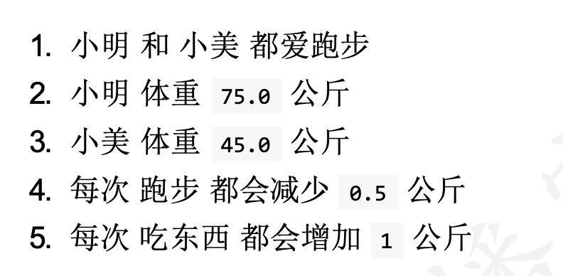

## Day06 作业题

## 简答题

### 1. 定义一个匿名函数:可以计算两个数字的和.

```python

```

### 2. 描述类的组成部分?

```python 

```

### 3. 书写定义类和创建对象的语法?

```python

```

### 4. 简述对 self 的理解?

```python 

```

### 5. 简述对`__init__` 方法的理解

```python

```

### 6. 简述对`__str__`方法的理解

```python

```


## 代码题

### 题目一

存在如下列表, 想要对列表中的字典按照 年龄大小排序,请书写代码完成这个需求.

```python
list1 = [{'name': 'd', 'age': 19}, {'name': 'b', 'age': 16}, {'name': 'a', 'age': 16}, {'name': 'c', 'age': 20}]
```


```python


```


### 题目 二

尝试根据以下要求完成代码



```python

```

### 题目三

定义一个学生类(Student): 

1. 包含属性 姓名`name`, 年龄`age`.

2. 包含方法: 

   1. 吃饭的方法`eat`, 在方法中输出`xx 要吃饭`, xx 为学生具体的名字
   2. 睡觉的方法`sleep`, 在方法输出`xx 要睡觉`, xx 为学生具体的名字
   3. 过年的方法`year`,  要求, 年龄增加一岁

3. 打印对象的时候, 输出 学生的 姓名和年龄信息格式如下

   `姓名: xxx, 年龄: xx 岁`, xx 为具体的名字和年龄

4. 创建两个对象, 并分别调用 吃饭和睡觉和过年的方法

   - 小明 18 岁
   - 小红  17 岁

```python
```


### 题目 四

定义一个电脑类(computer),

电脑有品牌(brand),有价格(price),能播放电影(play_movie)。

分别创建2个对象"小米电脑 `mi`" 和 "苹果电脑 `mac`"。分别调用放电影的动作, 输出内容格式如下: `xx 播放电影 oo`, xx 为 电脑品牌, oo 为电脑的名字, 电影名字作为参数传递即可

- 小米电脑播放 `葫芦娃`
- 苹果电脑 播放 `变形金刚`

```python

```


