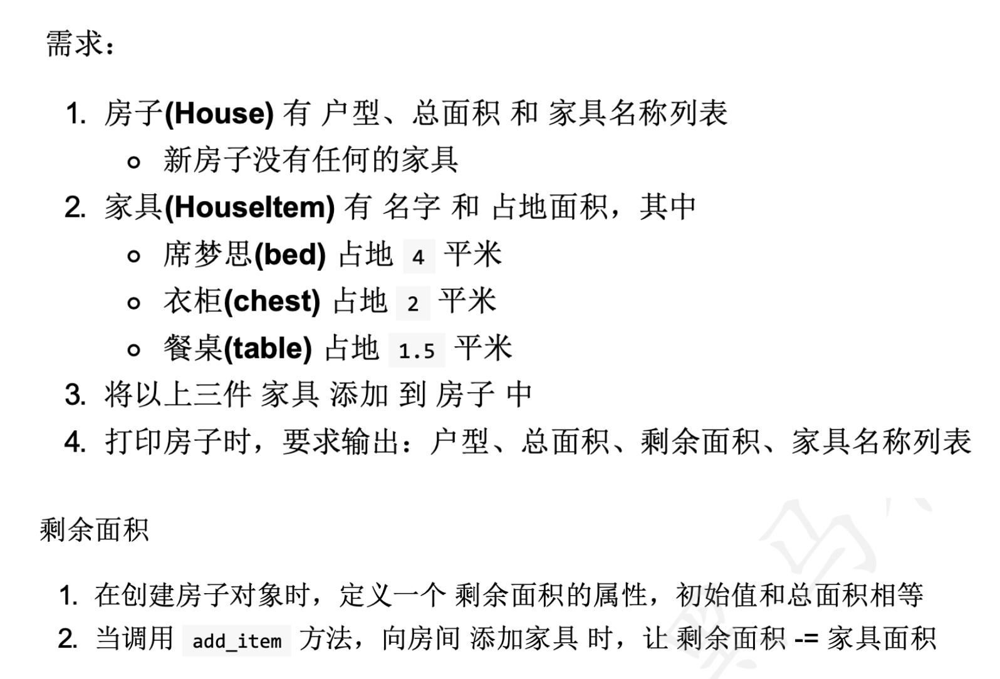

## Day 07 作业题

## 简答题

### 1. 简述继承的语法?

```python

```

### 2. 为什么要重写,什么是重写,重写后如何调用父类的方法?

```python
 
```

## 代码题

### 课上代码完成-- 存放家具



```python

```


### 课上代码完成 - Game 案例完成

```yacas
添加新需求：
记录获取最高分的玩家名字

主程序： 
创建 小王， 小李， 小张， 小红，...  分别玩游戏
```


```python
```


### 题目 3

定义Animal动物类，具有 吃肉 `eat`的方法，喝 `drink`的方法，睡觉 `sleep`的方法
定义 狗Dog 继承了动物类，具有汪汪叫 `bark`的方法

- 狗 去调用吃的方法
- 狗 去调用喝的方法

```python

```


