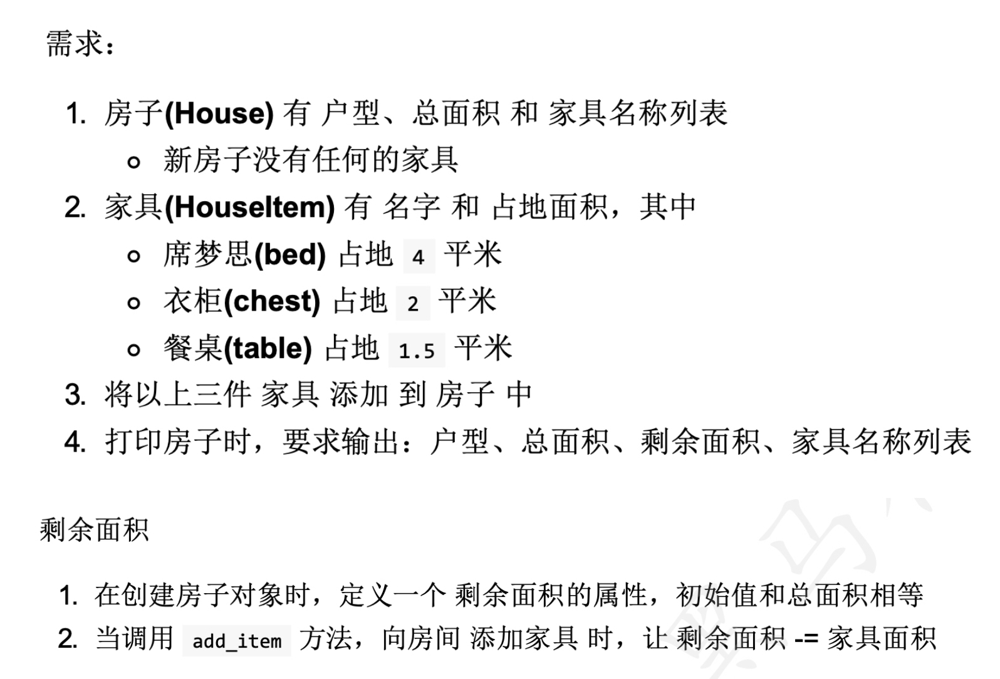

## Day 07 作业题

## 简答题

### 1. 简述继承的语法?

```python
class 类B(类A):
    pass
# 类 B继承类 A
```

### 2. 为什么要重写,什么是重写,重写后如何调用父类的方法?

```python
 # 为什么要重写
父类中的方法,不能满足子类对象的需求
# 什么是重写
子类实现了和父类同名的方法
# 重写后如何调用父类的方法
super().方法名()
```

## 代码题

### 课上代码完成-- 存放家具



```python

```


### 课上代码完成 - Game 案例完成

```yacas
添加新需求：
记录获取最高分的玩家名字

主程序： 
创建 小王， 小李， 小张， 小红，...  分别玩游戏
```


```python

```


### 题目 3

定义Animal动物类，具有 吃肉 `eat`的方法，喝 `drink`的方法，睡觉 `sleep`的方法
定义 狗Dog 继承了动物类，具有汪汪叫 `bark`的方法

- 狗 去调用吃的方法
- 狗 去调用喝的方法

```python
class Animal:
    """动物类"""
    def eat(self):
        """吃方法"""
        print("动物都爱吃")

    def drink(self):
        """喝的方法"""
        print("动物可以喝水")

    def sleep(self):
        """睡觉的方法"""
        print("动物都喜欢睡觉")

class Dog(Animal):     # 单继承  子类名(父类名)
    """子类  狗类"""
    def bark(self):
        """狗叫的方法"""
        print("狗汪汪叫的方法")

# 创建子类对象
dog = Dog()
dog.bark()

dog.eat()   # 子类对象可以调用父类的方法
dog.drink()


```


